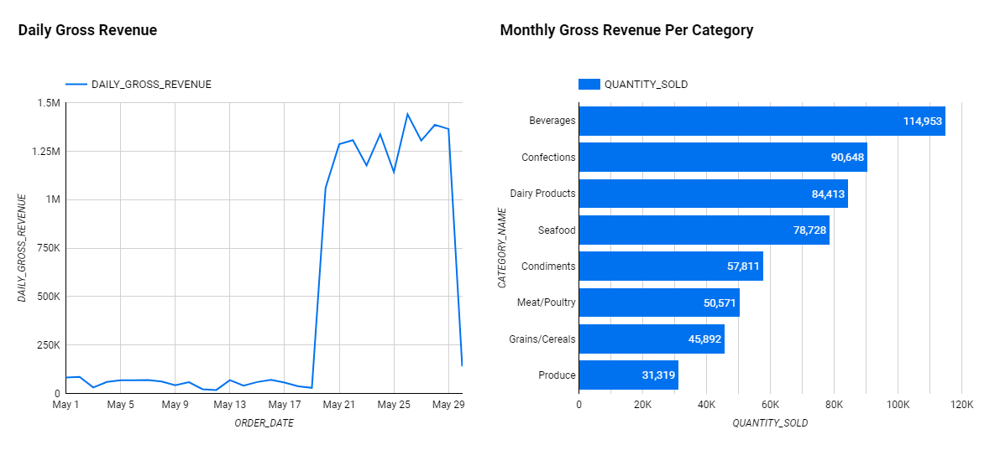

# Digital Skola Data Engineering 12 Final Project

## System Architecture

## Airflow Tasks Graph

## Tools Used
- python==3.8
- psycopg2==2.9.6
- snowflake-connector-python==3.0.3
- Airflow
- Snowflake
- Google Looker Studio

## Dashboard (May 2023)

